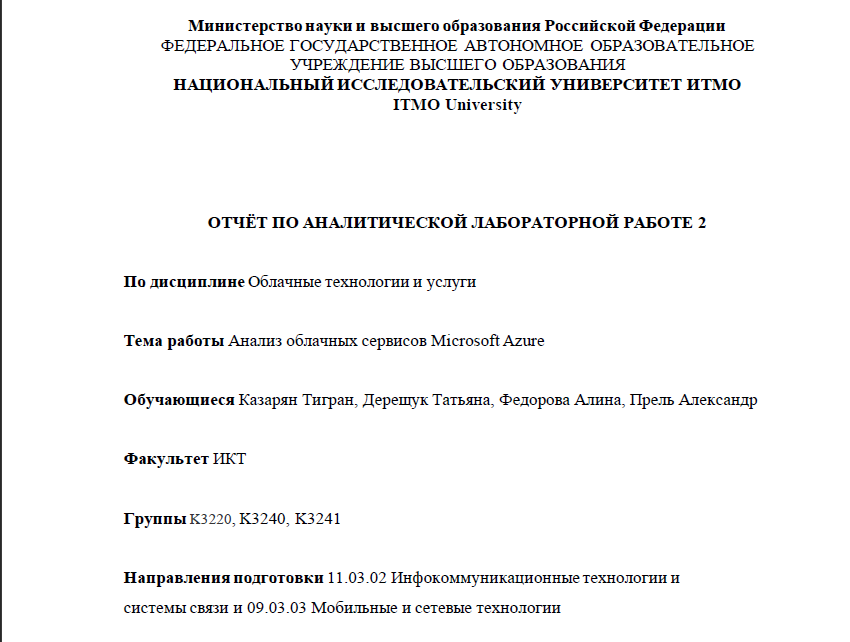
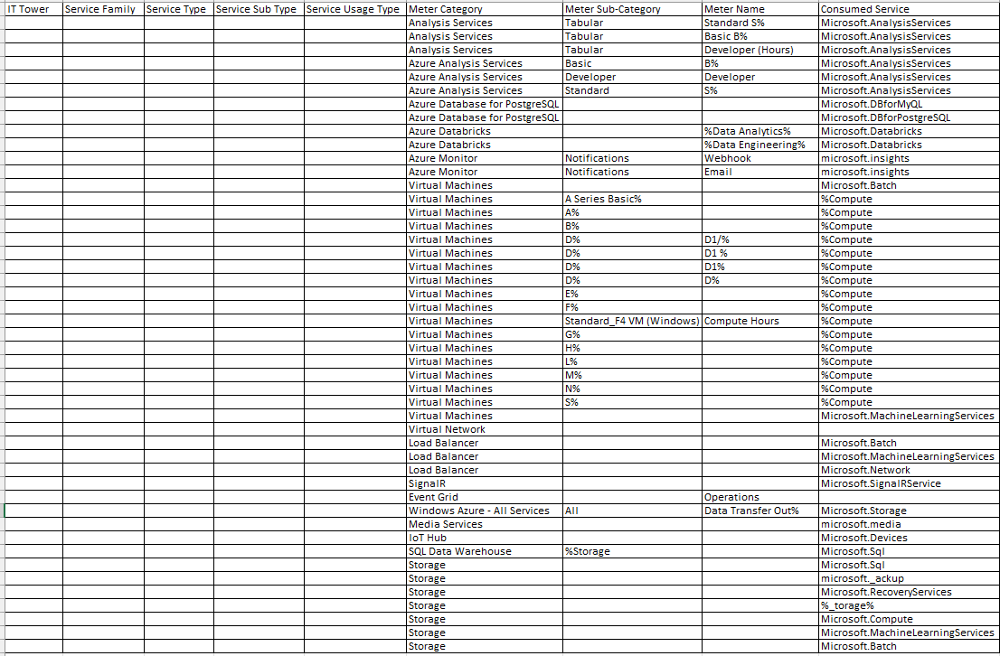
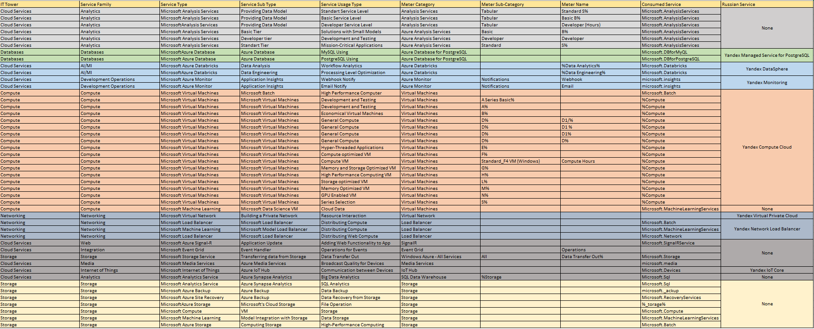

# Аналитическая лабораторная 1

### Цель работы

Знакомство с облачными сервисами. Понимание уровней абстракции над инфраструктурой в облаке. Формирование понимания типов потребления сервисов в сервисной-модели. Сопоставление сервисов между разными провайдерами. Оценка возможностей миграции на отечественные сервисы.

### Дано

1. Слепок данных биллинга от провайдера после небольшой обработки в виде SQL-параметров. Символ % в начале/конце означает, что перед/после него может стоять любой набор символов.
2. Google с документациями провайдера.

### Приведем описание параметров Apptio TBM Unified Model

| Хэдеры | Описание |
| --- | --- |
| IT Tower | Это группа, ответственная за управление инфраструктурой сервиса, его поддержку и характеристику. Примеры IT Tower - Storage, Machine Learning, Database, Security, Analytics, Compute.|
| Service Family | Это группа сервисов, которая выполняет конкретную инфраструктурную задачу и связана с конкретным приложением. Примеры Service Family - Application services, Management or provisioning, GPU-powered acceleration, In-memory caching service и другие...|
| Service Type | Это тип сервиса внутри определенной группы сервисов. Примеры Service Type -  Elastic File System, Elastic Inference, ElastiCache, GuardDuty, Kinesis и другие... |
| Service Sub Type | Это подтип сервиса с определенной функцией. Примеры Service Sub Type -- Fees, Acceleration, Cache Nodes, Security & Compliance и другие... |
| Service Usage Type | Это тип использования сервиса с учетом подтипа, также тип запросов, которые может выполнять пользователь с использованием конкретного сервиса. Примеры Service Usage Type - Standard Timed storage, Infrequent Access storage и другие... |

### Описание сервисов Microsoft Azure

| Сервис | Описание |
| --- | --- |
| Azure Analysis Services | Полностью управляемая платформа как услуга (PaaS), которая предоставляет модели данных корпоративного уровня в облаке. Использует расширенные функции гибридов и моделирования для объединения данных из нескольких источников данных, определения метрик и защиты данных в единой надежной табличной семантической модели данных. Модель данных предоставляет пользователям более простой и быстрый способ просмотра огромных объемов данных для специального анализа данных.|
| Azure Database for PostgreSQL | Служба реляционных баз данных в облаке Microsoft, созданная для разработчиков. Он основан на версии сообщества базы данных PostgreSQL с открытым исходным кодом и доступен в двух вариантах развертывания: Single Server и Hyperscale (Citus).|
| Azure Databricks | Аналитическая платформа на основе Apache Spark, оптимизированная для платформы облачных сервисов Microsoft Azure. Для большого конвейера данных данные (необработанные или структурированные) поступают в Azure через фабрику данных Azure в пакетном режиме или передаются в режиме реального времени с использованием Kafka, Event Hub или IoT Hub. Эти данные попадают в озеро данных для долговременного постоянного хранения.|
| Azure Monitor |Сервис, максимизирующий доступность и производительность приложений и услуг, предоставляя комплексное решение для сбора, анализа и обработки телеметрии из облачных и локальных сред. Он помогает понять, как работают ваши приложения, и проактивно выявляет проблемы, влияющие на них, и ресурсы, от которых они зависят.|
| Virtual Machines | Один из нескольких типов запрашиваемых масштабируемых вычислительных ресурсов, которые предоставляет Azure. Обычно виртуальную машину выбирают, когда требуется более строгий контроль за вычислительной средой, чем в других вариантах. |
| Azure Virtual Network | Служба, которая обеспечивает фундаментальный строительный блок для вашей частной сети в Azure. Экземпляр службы (виртуальная сеть) позволяет многим типам ресурсов Azure безопасно взаимодействовать друг с другом, Интернетом и локальными сетями. К таким ресурсам Azure относятся виртуальные машины (ВМ). |
| Azure Load Balancer | Служба Azure Load Balancer работает на уровне 4 модели OSI (Open Systems Interconnection). Она служит единственной точкой взаимодействия с клиентами. Load Balancer распределяет входящие потоки, поступающие на внешний интерфейс подсистемы балансировки нагрузки, в экземпляры серверных пулов. Эти потоки соответствуют настроенным правилам балансировки нагрузки и пробам работоспособности. Экземплярами серверного пула могут быть Виртуальные машины Azure или экземпляры в масштабируемом наборе виртуальных машин. |
| SignalR | Служба, которая позволяет в реальном времени и без усилий добавлять в приложения веб-функции по протоколу HTTP. Функции, работающие в реальном времени, позволяют службе отправлять обновления содержимого в подключенные клиенты, например одностраничные веб-приложения и мобильные приложения. В результате клиенты обновляются без необходимости опроса сервера или отправки новых HTTP-запросов на обновления. |
| Azure Event Grid | Служба, которая позволяет легко создавать приложения с архитектурой на основе событий. Сначала выберите ресурс Azure, на которой вы хотите подписаться, а затем укажите обработчик событий или конечную точку веб-перехватчика для отправки события. Служба "Сетка событий" обеспечивает встроенную поддержку событий, поступающих из таких служб Azure, как хранилища BLOB-объектов и группы ресурсов. Служба "Сетка событий" также поддерживает пользовательские события с использованием соответствующих разделов.|
| Azure Media Services |  Облачная платформа, которая позволяет создавать решения для потоковой передачи видео широковещательного уровня. Она повышает доступность и уровень распространения, дает возможность анализировать содержимое и предоставляет многие другие функции. Службы мультимедиа позволяют создавать приложения для обработки данных мультимедиа высокого качества для крупных аудиторий на самых популярных современных мобильных устройствах и браузерах для всевозможных сфер деятельности. Их могут использовать как разработчики приложений и центры обработки вызовов, так и государственные учреждения или компании, работающие в индустрии развлечений.|
| Azure IoT Hub | Служба, которая обеспечивает (двунаправленный) обмен данными между устройствами Интернета вещей и Azure. Надежный обмен данными между своим приложением Интернета вещей и устройствами, которыми оно управляет. Azure IoT Hub позволяет серверной части решения, размещенного в облаке, виртуально подключаться к любому устройству. |
| SQL Data Warehouse | Эта служба позволяет вам запрашивать данные, используя бессерверные ресурсы по запросу или подготовленные ресурсы в любом масштабе.|
| Azure Storage | Управляемая Microsoft служба, предоставляющая облачное хранилище, которое является высокодоступным, безопасным, долговечным, масштабируемым. Служба хранилища Azure предлагает масштабируемое хранилище объектов для объектов данных, службу файловой системы для облака, хранилище надежных сообщений и хранилище NoSQL. |

### Начальная таблица

### Конечная таблица

### Вывод

В ходе аналитической лабараторной работы было осуществлено знакомство с облачными сервисами Microsoft Azure. Также было проведенно исследование российского рынка на предмет отечественных аналогов ([Yandex Cloud](https://cloud.yandex.ru/)).

После анализа российского рынка, стало понятно, что мы не можем полностью перейти на сервисы российского аналога.
