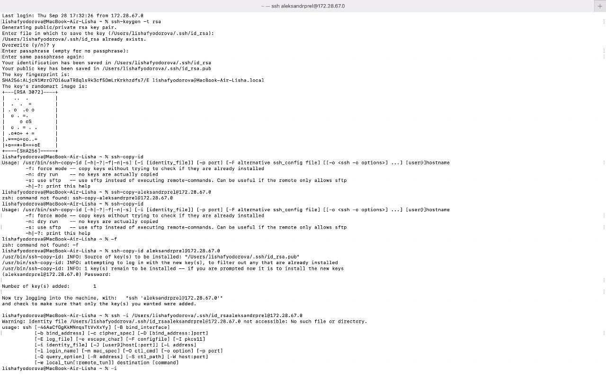
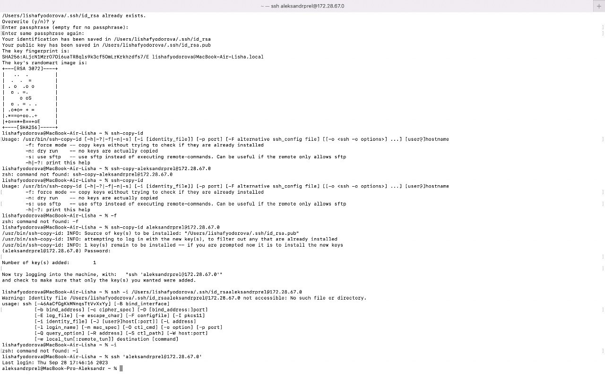

# Задание 1*
## Сделать аналогичное, но подключаться при помощи публичных и приватных ключей, а не по логину паролю.

1) Генерируем пару ключей на компьютере А: публичный и приватный.
2) Копируем публичный ключ на компьютер Б и подключаемся к нему через приватный ключ.
3) Получаем удаленный доступ к терминалу компьютера B. Теперь мы можем передать файл с этого компьютера на компьютер С с терминала компьютера А.
4) Profit!

