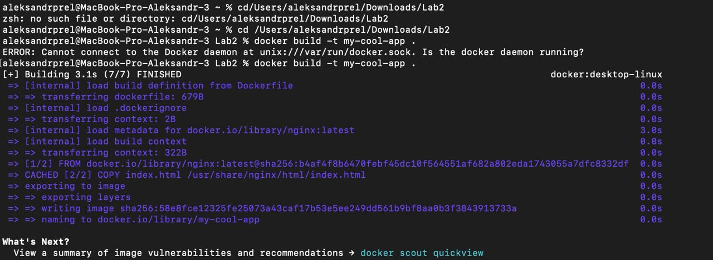
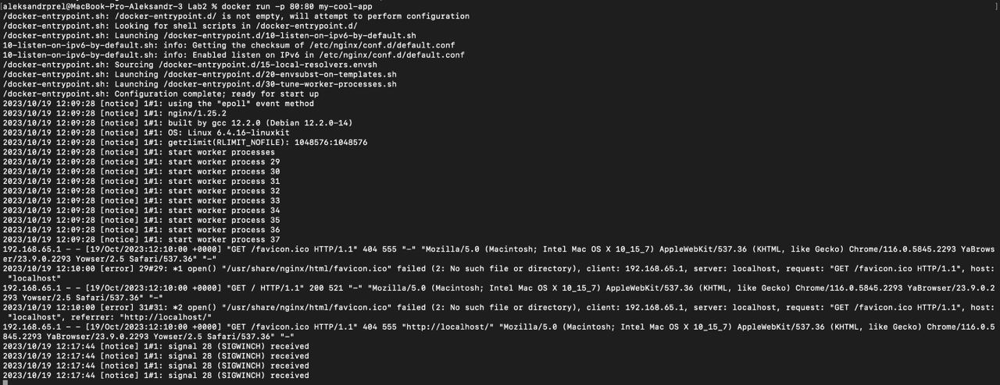
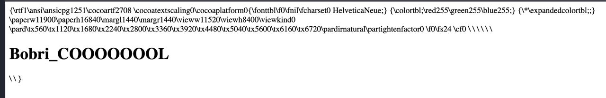

# Задание 2

## Наша задача - написать два Dockerfile – плохой и хороший. Плохой должен запускаться и работать корректно, но в нём должно быть не менее 3 “bad practices”. В хорошем Dockerfile они должны быть исправлены. В Readme описать все плохие практики из кода Dockerfile и почему они плохие, как они были исправлены в хорошем  Dockerfile, а также две плохие практики по использованию этого контейнера. Ход нашей работы

Мы решили написать Докерфайл, поднимайющий вебсервер и выводящий на экран надпись Bobri_COOOOOOOL. Выглядел он так:

HTML file выглядит так

```
<!DOCTYPE html>
<html>
<head>
    <title>Bobri_COOOOOOOL</title>
</head>
<body>
    <h1>Bobri_COOOOOOOL</h1>
</body>
</html>
```

## Плохой Dockerfile

```# Используем базовый образ Debian
FROM debian:latest

# Устанавливаем Nginx из исходных кодов
RUN apt-get update && apt-get install -y nginx

# Заменяем стандартную страницу Nginx
COPY index.html /var/www/html/index.html

# Запускаем Nginx в фоновом режиме с root-правами
CMD ["nginx"]
```

### 1) Запустили код с помощью команд





### 2) Проверяем через приложение Docker состояние работы файла, а также корректность отображения сайта. "Плохой" Dockerfile запущен


### 3) Вот что мы получили на выходе



## Плохие методы, использованные в данном Dockerfile

1. Использование базового образа Debian, который не рекомендуется из-за его размера и медленной скорости обновлений.
2. Установка Nginx из исходных кодов, что может привести к проблемам с зависимостями и безопасностью.
3. Замена стандартной страницы Nginx без явного указания источника файла index.html.
4. Запуск Nginx в фоновом режиме с root-правами, что является не безопасной практикой.

## Хороший Dockerfile

```# Используем базовый образ с Alpine Linux, который является легковесным и безопасным
FROM nginx:latest

# Копируем наш файл index.html в директорию по умолчанию для Nginx
COPY index.html /usr/share/nginx/html/index.html

# Запускаем Nginx в переднем режиме с непривилегированным пользователем
CMD ["nginx", "-g", "daemon off;"]
```
